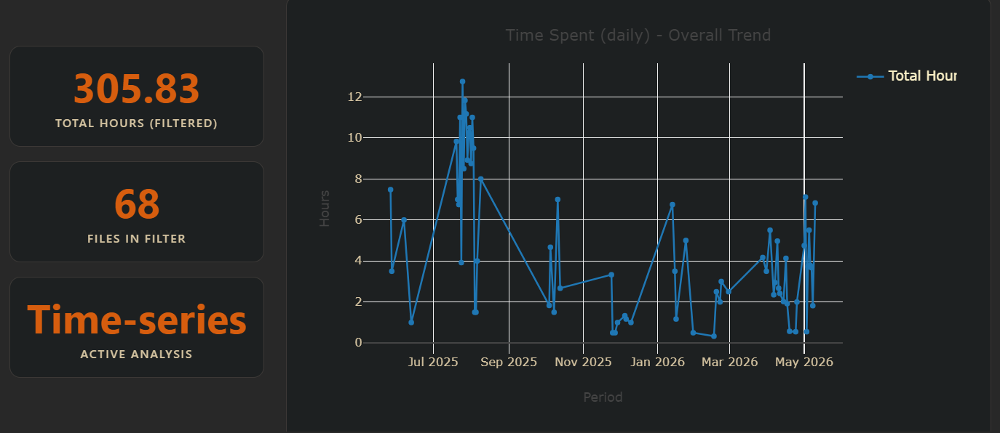

# Future & Sustainability

Overaching GOAL is to work towards a comprehensive HUB for all timed events and their analysis purely locally and within your vault, focused entirely on boosting your productivity.

!!! success
    **Full Calendar Remastered (FCR)** will remain fully open-source forever, backed by my personal "best effort" maintenance.

## The Philosophy of Equal Access
This project operates on the core principle of **Open Source Equality**. Unlike "Open Core" or "Sponsorware" models, **Full Calendar Remastered** does not gate features, provide early access, or prioritize bug fixes based on financial contribution. It shall remain free, open source and democratic in its complete sense.

!!! info "How development priorities are actually decided:"
    1. **Criticality:** Does the bug break core calendar functionality?
    2. **Popularity:** How many users and workflows are affected?
    3. **Feasibility:** Does the feature align with the project's long-term architecture?

See here for the [Developement Timeline](https://github.com/users/YouFoundJK/projects/2).

## The Economic Reality of Maintenance
While the software is free, the infrastructure required to build it at a high velocity is increasingly becoming expensive. Over the last year, the [current maintainer](https://github.com/YouFoundJK/) has managed to [push features](https://youfoundjk.github.io/plugin-full-calendar/whats_new/) at break neck speed:

  <em>A live look at the development effort poured into Full Calendar Remastered over the past year.</em>

With contributions attributed to roughly

- **75%** Agentic coding agents Orchestration
- **25%** Architecture and System Design; Manual Refactor, docs, cleanup

{ style="display: block; margin: 0 auto;" }

Spread across a **305.83 Hours** of Developer Time (27 May 2025 to 10 May 2026). Measured via [Activity Watch](https://youfoundjk.github.io/plugin-full-calendar/user/calendars/activitywatch/) + [ChronoAnalyser](https://youfoundjk.github.io/plugin-full-calendar/user/chrono_analyser/) integrations. My [freelancing hourly rate](https://www.upwork.com/freelancers/~010170cbba31f704df) might be able to put a facevalue to what that time is worth in a different universe. 

### The Shift in AI Development Tools
Much of Coding Agents leverage was *subsidised via university affliation + student plan free tiers*. But recently and forseeable future there has been an onslaught in rate limiting and throttling.

-  **Copilot Student Pro:** [31 Mar 26 - Rate Limiting](https://github.com/orgs/community/discussions/191188) and [1 Jun 26 - Moving from Request to Token based billing](https://docs.github.com/en/copilot/concepts/billing/usage-based-billing-for-individuals) with almost complete blackout past weekly limits.
-  **Gemini Student AI Pro:** [10 Mar 26 - Pro Quota Limits](https://discuss.ai.google.dev/t/navigating-antigravity-pro-quota-limits/130212) with almost complete blackout past weekly limits.

### What this means for You and Me

FCR will continue to receive maintenance and feature updates, **along the same Developer Time as before**, but rate limiting of Coding agents would mean either 

- I **upgrade the plan** or 
- go back to old school **manual code writing** (much slower updates and features).

It is along these lines, I have decided to emphasis a monthly fundraising aimed for the sustainance of a Pro Plan.

### Transparency of Funds
To remain sustainable, I am seeking a community-wide subsidy of **$25 USD per month**. 

| Item | Cost | Rationale |
| :--- | :--- | :--- |
| **Pro AI Plan** | $20.00 | Required for high-velocity coding and complex integration testing. |
| **Fees & Taxes** | ~$5.00 | Covers Stripe/PayPal/GitHub processing fees and local currency conversion. |
| **Total** | **$25.00** |   |

## Future Scenarios
*   **Goal Met:** I continue to provide "breakneck" updates, new integrations, and weekly community support. Expect **1-2 releases monthly**, with emphasis on community requested features.
*   **Goal Not Met:** The project enters **Maintenance Mode** - same effort as today, but at much slower pace (attributed to manual code writing). Expect releases on a **quarterly basis** (once every three months). 

 

By donating, you aren't buying a [premium service](#the-philosophy-of-equal-access)—you are simply backing an opensource project that has made your life easier and ensuring it continues to thrive for everyone. 

  <a href="https://github.com/sponsors/YouFoundJK" class="md-button md-button--primary">❤️ Contribute to the Stewardship Fund Here</a>

 