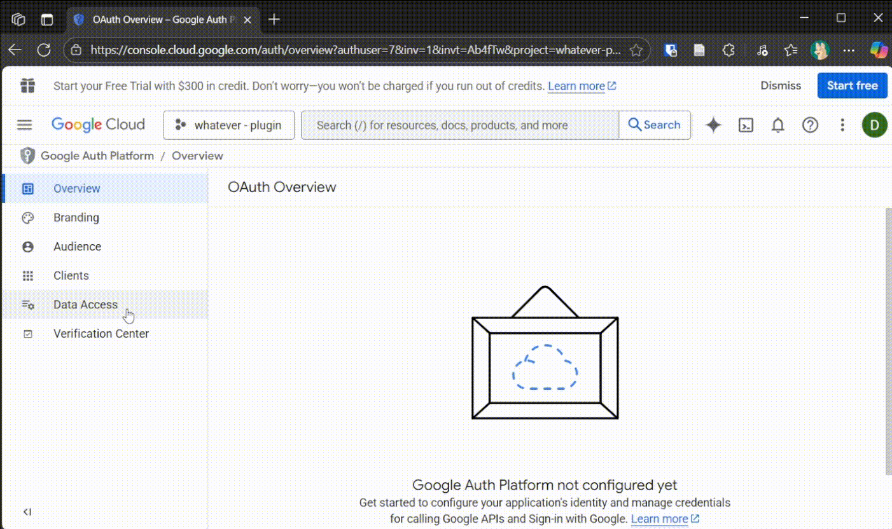

# Google Calendar Two-Way Sync

Easily add, edit, and delete events from your private Google Calendar directly in Obsidian using **OAuth 2.0 authentication**.

!!! info You must use the **Custom Google Cloud Credentials** option. The default option will not work until Google officially verifies the plugin.

Calendars automatically refresh every **5 minutes**.
To manually refresh calendars, run the command:
`Full Calendar: Revalidate remote calendars`

---

## Using with Advanced Categories

Google Calendar events fully support the **[Advanced Categories feature](../events/categories.md)**.

If an event title is formatted like `Personal - Doctor's Appointment`, the plugin will automatically detect **Personal** as the category and apply any custom color configured in your settings.
This helps you keep events organized across all your devices.

---

## Setting Up OAuth 2.0 Authentication

You’ll need to create your own **Google OAuth Client ID and Secret** for personal use.
Here’s how to set it up step by step:

### 1️⃣ Create a Project in Google Cloud Console

### 2️⃣ Configure OAuth Consent Screen

### 3️⃣ Enable the Google Calendar API

### 4️⃣ Add Your Google Account as a Test User

### 5️⃣ Create OAuth Credentials for a Desktop Client

### 6️⃣ Add Your Client ID and Secret to the Plugin

---

Once completed, you’ll be able to **sync your Google Calendar both ways**—any changes made in Obsidian will be reflected in Google Calendar, and vice versa.
