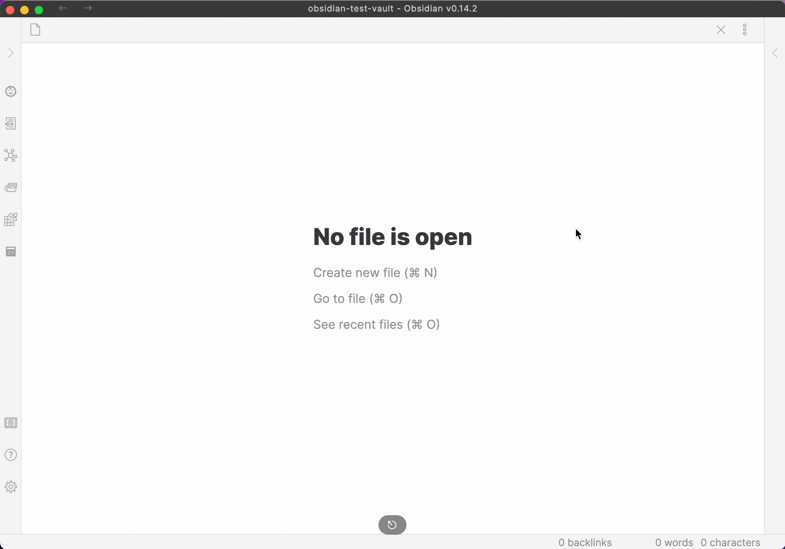
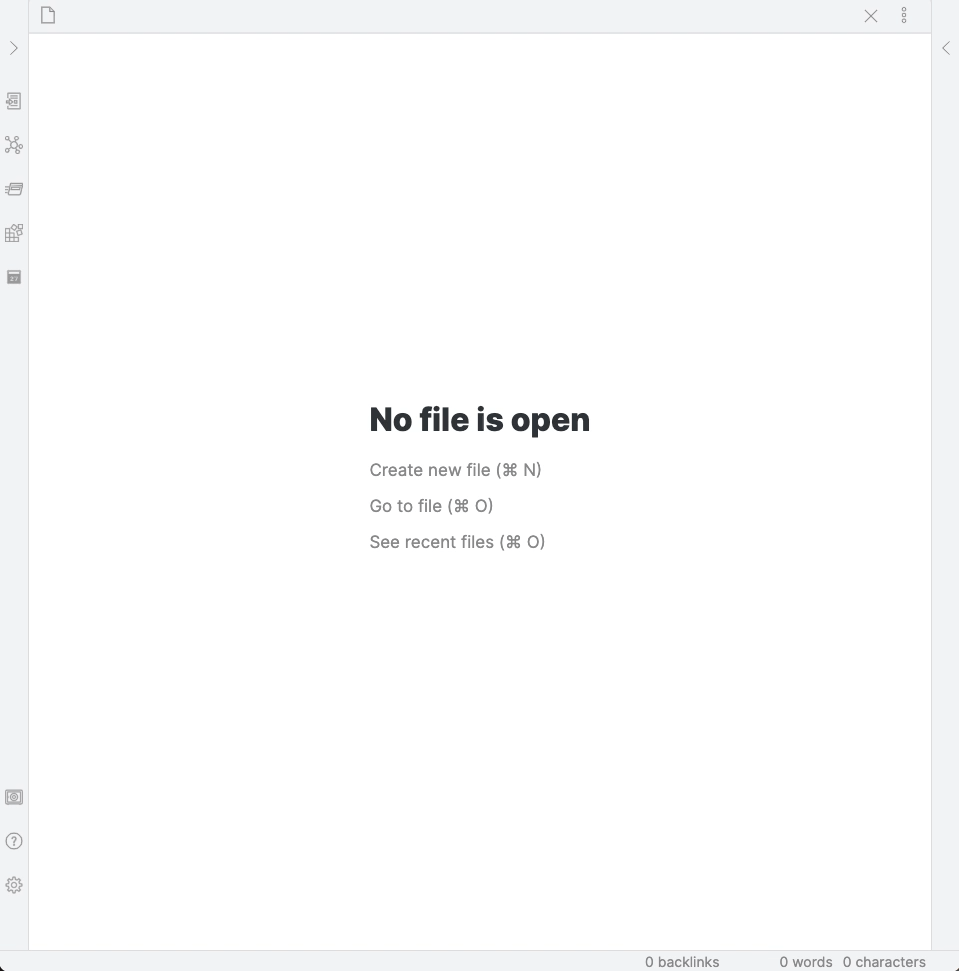
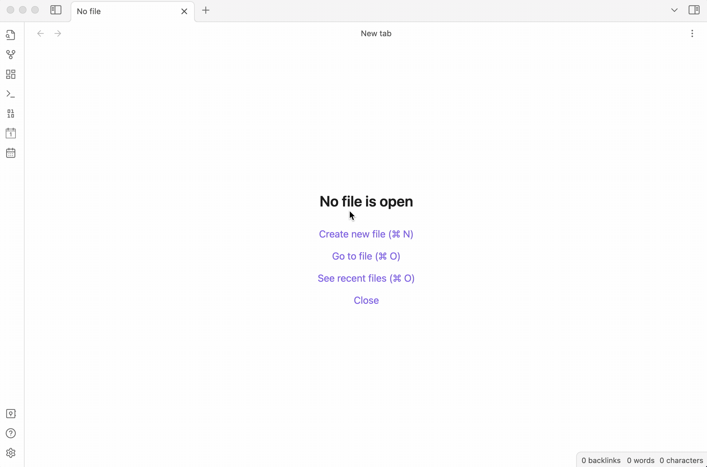

# Getting Started

!!! abstract "Welcome to Full Calendar Remastered"
    This guide will walk you through the installation, initial setup, and basic usage of the plugin. For a faster start, check out the [Pro Workflow](#pro-workflow) tips below.

Fast track through [Installation](#installation) · [First-Time Setup](#first-time-setup) · [Opening the Calendar](#opening-the-calendar)  
[Sidebar Calendar](#sidebar-calendar) · [Troubleshooting](user/guides/troubleshooting.md)  

## Pro Workflow

!!! tip "Hybrid Calendar Model"
    Use a combination for [Full Note](user/calendars/local.md) (for [recurring](user/events/recurring.md) and other detailed events) and [Daily Note Calender](user/calendars/dailynote.md) (daily events stored compactly). Also check out [Advanced Categorization](user/events/categories.md) and its **event naming convention**, to unleash the full power of this plugin and supercharge your workflow!

!!! example "Master the FCR Command"
    For the fastest experience, skip the buttons and use the **[FCR Command (NLP Orchestrator)](user/features/nlp.md)**. Open it with via the command palette `Ctrl/Cmd + P` (or add custom keyboard shortcut for direct access) and type naturally: *"Team sync tomorrow at 3pm"* or *"go to next week"*. It's the "brain" of the plugin and the most efficient way to get things done QUICK.

## Installation

=== "BRAT (Recommended)"

    !!! info "Beta Updates with BRAT"
        1. Install the **[BRAT](https://obsidian.md/plugins?search=brat)** plugin from the Obsidian Community Plugins store.
        2. Open the command palette (++ctrl+p++) and run `BRAT: Add a beta plugin for testing`.
        3. Enter the repository URL: `https://github.com/YouFoundJK/obsidian-full-calendar`
        4. Click **Add Plugin**.
        5. Enable **Full Calendar** in your Community Plugins settings.

=== "Manual Installation"

    !!! info "Manual Setup"
        1. Go to the [latest release](https://github.com/YouFoundJK/obsidian-full-calendar/releases/latest) on GitHub.
        2. Download `main.js`, `manifest.json`, and `styles.css`.
        3. In your Obsidian vault, navigate to `.obsidian/plugins/` and create a folder named `obsidian-full-calendar`.
        4. Move the downloaded files into that folder.
        5. Restart Obsidian or go to **Settings > Community Plugins** and click the **Reload** icon.
        6. Enable **Full Calendar**.

## First-Time Setup

When you open Full Calendar for the first time, you'll be prompted to add your first [calendar source](user/calendars/index.md).

It's recommended to start with a [local calendar type](user/calendars/index.md), as these are editable directly from the plugin.

-   **[Full Note Calendar](user/calendars/local.md):** The most powerful option. Each event is a separate note in your vault.

-   **[Daily Note Calendar](user/calendars/dailynote.md):** Store events as checklist items in your daily notes, in a efficient and compact way.

## Opening the Calendar

You can open the main calendar view in two ways:
1.  Click the **Calendar icon** in the Obsidian ribbon (the left-hand bar).
2.  Run the command [`Full Calendar: Open Calendar`](user/guides/commands-and-shortcuts.md) from the command palette (`Ctrl/Cmd + P`).

## Sidebar Calendar

For quick reference, you can open a more compact version of the calendar in the sidebar. Run the command [`Full Calendar: Open in sidebar`](user/guides/commands-and-shortcuts.md).

