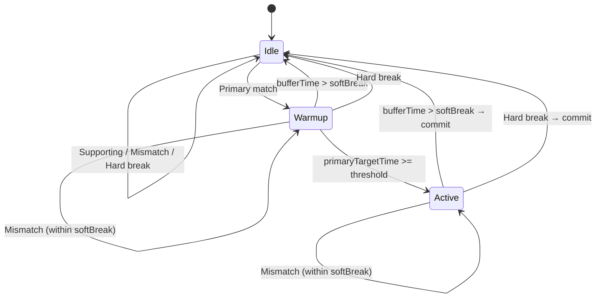

# ActivityWatch Integration: Best-Fit Engine

Full Calendar integrates deeply with [ActivityWatch](https://activitywatch.net/){: target="_blank" rel="noopener" }, enabling you to transform granular, noisy computer usage timelines into beautiful, semantic intent-based calendar blocks natively inside Obsidian.

The engine uses a deeply mathematical **Best-Fit [Finite State Machine (FSM)](https://en.wikipedia.org/wiki/Finite-state_machine){: target="_blank" rel="noopener" }**. Instead of mapping one event to one block, it evaluates your timeline using "Context Profiles" to generate optimal sessions that reflect what you were *actually* doing, automatically filtering out minor distractions.

!!! tip "Recommended"
    For best experience use it together with [Advanced Categories](../events/categories.md){: target="_blank" rel="noopener" } feature, allowing you to color-code your events and organize them for [Timeline](../views/timeline_view.md){: target="_blank" rel="noopener" } and Advanced analysis via [ChronoAnalyser](../chrono_analyser/index.md){: target="_blank" rel="noopener" }. It's **highly recommended**!

---

## 1. Context Profiles

Instead of simple mapping rules, you create **Context Profiles**. Each profile represents an "Intent" (e.g., "Study", "Gaming", "Coding").

### Settings

| Setting | Description |
|---|---|
| **Profile Name** | Identifier for this profile. Becomes the sub-category label on the calendar block. |
| **Category (Color)** | The color tag applied to the block in Full Calendar (maps to your existing [Category Colors](../events/categories.md){: target="_blank" rel="noopener" }). |
| **Activation Threshold (Mins)** | The minimum accumulated matching time required before a session "locks in." If you match for 8 minutes and stop, but your threshold is 10, it will not appear on the calendar. Intelligently incorporates **Soft Break** so 8 min match + 2 min away (< Soft Break Limit) + 2 match will still count |
| **Soft Break Limit (Mins)** | The hysteresis buffer. Dictates how long you can be *mismatching* (e.g. checking Twitter, a bathroom break, or going AFK) before the session is formally terminated. Return to a matching app before this limit expires and the session continues seamlessly. |
| **Title Template** | The template string for the calendar block title (see [Section 4](#4-dynamic-title-templating)). |

---

## 2. Granular Rules (Primary, Supporting, Hard Break)

You define exactly what drives a Profile using fine-grained nested rules.

*   **Primary Evidence Rules**: Strong evidence. If any rule matches, the timeline slice is a **primary match**. Primary matches can start warmup, contribute to activation threshold, and sustain active sessions.
*   **Supporting Evidence Rules**: Continuity evidence. If any rule matches, the timeline slice is a **supporting match**. Supporting matches can sustain warmup/active sessions but cannot start from idle, and do not contribute to activation threshold.
*   **Hard Break Rules**: If any rule matches, it **immediately terminates** the warmup/active session, completely bypassing the soft break limit.

Priority is always: **Hard Break > Primary Match > Supporting Match > Mismatch**.

### Constructing a Rule

When adding a rule, you specify a **Bucket**, **Field**, and **Pattern**. The UI provides native autocomplete dropdowns for standard ActivityWatch buckets:

| Shorthand | Maps To | Description |
|---|---|---|
| `window` | `aw-watcher-window` | Tracks the active window title and application name |
| `web` | `aw-watcher-web` | Tracks browser tabs via the AW browser extension |
| `afk` | `aw-watcher-afk` | Tracks idle/active status based on mouse and keyboard activity |

You can also type any custom bucket name for third-party watchers.

#### Fields

Once a bucket is selected, you must select the JSON key from the watcher payload. Common fields include:

| Bucket | Available Fields |
|---|---|
| **window** | `app`, `title` |
| **web** | `url`, `title`, `audible` |
| **afk** | `status` |

#### Pattern Matching

You then apply either a **literal string search** or enable **Regex** for more powerful matching:

*   **Literal**: Case-insensitive substring match. Pattern `obsidian` will match `Obsidian.exe - My Vault`.
*   **Regex**: Full regex with the `i` (case-insensitive) flag applied automatically. Pattern `Code|Antigravity` will match both `Code.exe` and `Antigravity.exe`.

!!! tip "All matching is case-insensitive"
    You don't need to worry about casing. `YouTube`, `youtube`, and `YOUTUBE` are all equivalent in both regex and literal modes. Bucket types and field names are also resolved case-insensitively.

---

## 3. How The Engine Works

The engine processes your ActivityWatch data through a 3-phase pipeline.

### Phase 0: Multi-Dimensional Sweepline

Raw ActivityWatch events from multiple buckets (window, web, AFK) frequently overlap in time.

The engine uses a **Multi-Dimensional Sweepline Algorithm**. It marches chronologically through time, tracking *all* buckets simultaneously. Whenever an event starts or ends (e.g. your active window changes, a browser tab updates, or you go AFK), the engine slices the timeline and takes a "snapshot".

Each slice of time stores **the entire concurrent state of your computer**, for instance:
* `Window`: `LockApp.exe`
* `AFK`: `status: afk`
* `Web`: `(null)`

This parallel snapshot guarantees **zero data loss from arbitrary prioritization**. Web watcher entries, window tracking, and AFK idle states are packaged and passed into the evaluation pipeline *simultaneously*.

!!! note "AFK and Web Integration"
    - **AFK Integration**: The engine tracks your AFK idle state. You explicitly define in your Profile rules whether `status: afk` should trigger a Primary Break, or cleanly sustain a session as Supporting Evidence!
    - **Web Browser Noise Filter**: To eliminate background-tab noise, Web bucket entries are mapped into the snapshot *only* if your currently active Window is a known internet browser. Background tabs will never corrupt your active IDE coding sessions.

### Phase 1: Hypothesis Generation (The FSM)

For each Context Profile, the engine walks through the splintered timeline using a **3-state Finite State Machine**:

**States:**

| State | Description |
|---|---|
| **Idle** | No session in progress. Waiting for a **primary** matching event. |
| **Warmup** | A match has started but hasn't yet accumulated enough time to meet the activation threshold. |
| **Active** | The session has met the threshold and is "locked in." It will be committed to the calendar when the session ends. |

**Key behaviors:**

*   **Gap Detection**: Chronological gaps between events (where ActivityWatch simply has no data) are counted as buffer time. If the accumulated gap + mismatch time exceeds the soft break limit, the session ends.
*   **Primary vs Supporting Accounting**: Only primary matches increase activation threshold time. Supporting matches keep continuity but do not help activate a session.
*   **AFK Is Profile-Defined**: AFK can be treated as supporting evidence (recommended for passive tasks like video watching), or left as mismatch. AFK is only a hard break if you explicitly configure it as one.
*   **Session Trimming**: When a session is committed, it ends at the timestamp of the **last evidence event** (primary or supporting), not at trailing mismatches. If you code until 23:08, remain AFK as supporting evidence to 23:15, then mismatch, the session is booked through 23:15.

### Phase 2: Greedy Best-Fit Allocation

Because multiple profiles can match the same time window (e.g., using Obsidian might match both "Coding" and "Study"), the engine resolves conflicts predictably:

1.  **Fitness Scoring**: Each candidate session gets a `fitness_score` equal to the total milliseconds that matched **primary evidence** during that block.
2.  **Greedy Allocation**: Candidates are sorted globally by fitness score (descending). The highest-fitness block claims its time first.
3.  **Geometric Subtraction**: Lower-fitness blocks that overlap with already-booked blocks are geometrically trimmed. If the overlap is total, the weaker block is dropped.
4.  **Sub-Chunking**: If trimming leaves a surviving fragment that still meets the `activationThresholdMins`, it is preserved as an independent calendar block.

!!! example "Conflict Resolution Example"
    You have two profiles: **Coding** (Obsidian + VSCode + Browser) and **Study** (Obsidian + Zotero + Browser). Your workflow: Obsidian (5 min) → Browser (10 min) → Zotero (12 min) → AFK.

    - **Coding** fitness: 5 + 10 = 15 minutes of matching
    - **Study** fitness: 5 + 10 + 12 = 27 minutes of matching

    Study wins. It claims 0→27m. Coding's 0→15m candidate is fully swallowed and dropped. Result: a single "Study" block from 0:00 to 0:27.

---

## 4. Dynamic Title Templating

You do not need to manually name your calendar blocks. Inject the actual metadata from the underlying ActivityWatch event directly into the block title using `{brackets}`.

**Template**: `Coding - {app}`

If the session spanned multiple events, the engine calculates the **majority payload** from primary-evidence splinters first, then falls back to all splinters if needed. The data active for the longest total duration is used for template substitution.

Result: `Coding - Code.exe` (or whatever `app` name VSCode reports).

Available template variables depend on the watcher data. Common ones:

| Variable | Source | Example |
|---|---|---|
| `{app}` | Window watcher | `Obsidian.exe`, `Code.exe` |
| `{title}` | Window watcher | `main.ts - plugin-full-calendar` |
| `{url}` | Web watcher | `https://github.com/...` |

---

## 5. Sync Strategy

| Strategy | Description |
|---|---|
| **Sync from Last Checked** | Pulls data from the last checked time to the current run. Manual syncs and automatic syncs both advance the last checked time after a successful run. Also performs continuity ownership checks and can rebuild from the original continuity start when safe. |
| **Custom Date Range** | Debug-only manual range. It does not update the last checked time and it cannot run automatically. Useful for backfilling or testing a specific window. |

!!! warning "Custom Date Range"
    Custom Date Range is intentionally isolated from normal syncing. Ensure the start and end dates are different. Setting both to the same date results in a zero-width time window and no events will be fetched.

### Last Sync Visibility

When using **Sync from Last Checked**, the configuration UI shows the latest checked timestamp directly below that strategy option. Manual sync and automatic sync both update this timestamp. Custom Date Range never updates it.

### Continuity Rewrite Safety Rules

For auto sync, continuity rewrite runs only when all checks pass:

1. The latest event in the bounded sync-boundary window belongs to a known ActivityWatch profile in the configured target calendar.
2. Reconstructing ActivityWatch blocks for that event's exact prior range yields a matching normalized title.
3. ActivityWatch still has source evidence near the prior event start (1-minute tolerance).

If continuity is validated, sync anchors from the original continuity start (with a small buffer), rebuilds blocks through now, deletes the existing ActivityWatch-owned events in that rebuilt range, and writes the reconstructed blocks back into the configured provider.

If coverage is incomplete, source evidence is missing, delete capability is unavailable, or an existing event cannot be resolved/deleted, the continuity rewrite is skipped instead of creating duplicates.

### Auto Sync

You can enable automatic ActivityWatch syncing from the configuration modal.

| Setting | Description |
|---|---|
| **Enable automatic sync** | Runs ActivityWatch sync on a timer without manually triggering the command. |
| **Auto-sync interval (minutes)** | Interval between sync runs. Default is **10** minutes. |

Auto-sync runs only for the **Sync from Last Checked** strategy. Selecting **Custom Date Range** disables automatic sync because custom ranges are manual debug/backfill runs and do not advance the last checked time.

## 6. Global Kill Switch Behavior

The top-level setting **Enable ActivityWatch Sync** is the global kill switch.

When this toggle is OFF:

* ActivityWatch sync logic is inactive.
* Automatic sync timers are not scheduled.
* The ActivityWatch command is not available from the command palette.
* Saved ActivityWatch settings and profile data remain stored, but are not touched or used.

When toggled back ON, the saved configuration becomes active again.

## FAQ

#### Why is Watcher in chrome not automatically recording?
- This is a bug within the aw-chrome extension - [aw-watcher-web/199](https://github.com/ActivityWatch/aw-watcher-web/issues/199) and a easiest fix is via building your own from the pull request and using it in your Chrome based browser via the Developer mode.
