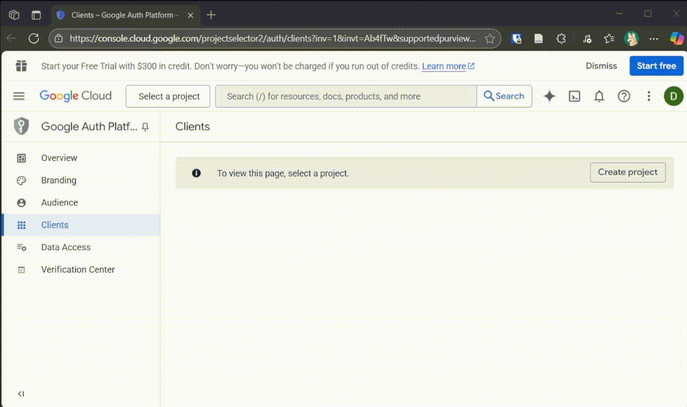
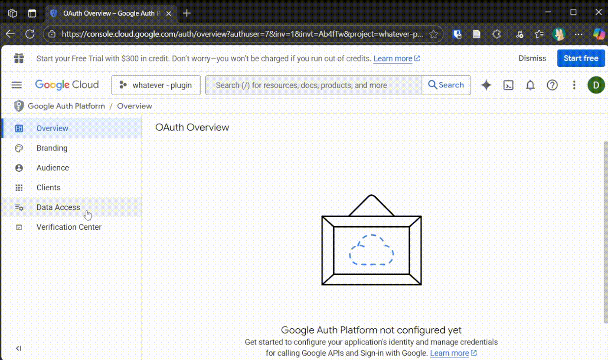
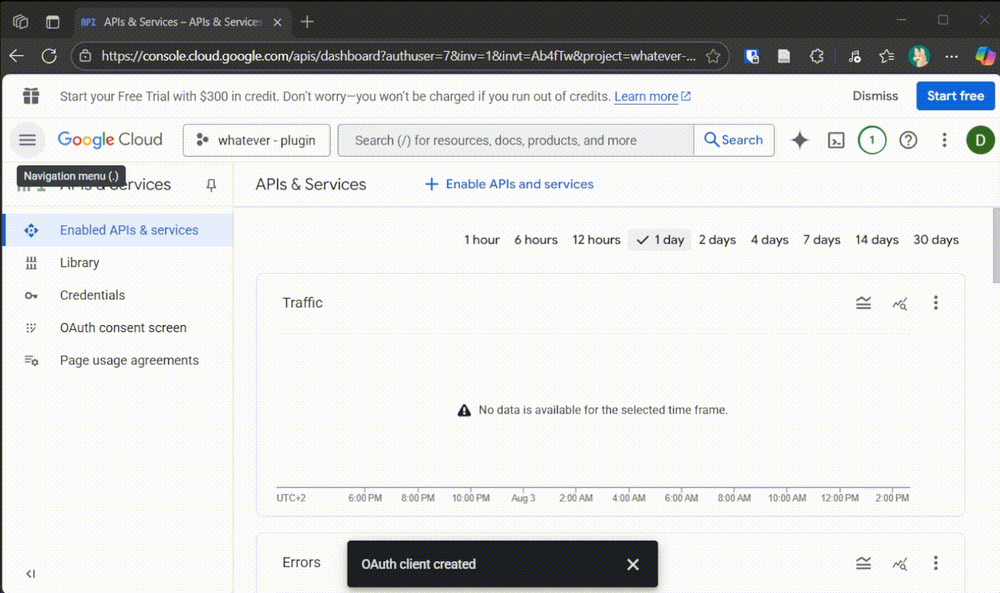
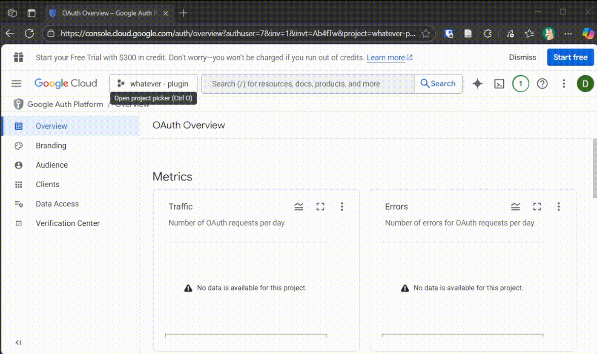

# Google Calendar Two-Way Sync

Easily add, edit, and delete events from your private Google Calendar directly in Obsidian using **OAuth 2.0 authentication**.

!!! success "Verified Integration"
    Full Calendar Remastered is an officially verified Google integration. You can now connect your accounts directly without creating your own Google Cloud credentials.

Calendars automatically refresh every **5 minutes**. To manually refresh calendars, run the **[FCR Command](../features/nlp.md)**: `refresh calendars` or use the command `Full Calendar: Revalidate remote calendars`.

!!! tip "Power Up with Categories"
    Google Calendar events fully support **[Advanced Categories](../events/categories.md)**. Use a title like `Personal - Doctor` to automatically apply your "Personal" color and styling.

---

## Quick Start: Connecting Your Account

1.  Open **[Full Calendar Settings](../settings/index.md) → [Calendar Sources](../settings/sources.md)**.
2.  Click **Add Source** and select **Google Calendar**.
3.  Click **Login with Google**. This will open your default browser.
4.  Follow the standard Google sign-in flow.
5.  Once authorized, select the specific calendars you want to display in Obsidian.

---

---

## Advanced: Custom Google Cloud Credentials (Optional)

If you prefer to maintain your own OAuth Client ID and Secret for privacy or development reasons, you can enable **Custom Credentials** in the **[API and Security Settings](../settings/api.md)**.

### Step-by-Step Setup Guide

#### 1️⃣ Create a Project in Google Cloud Console

#### 2️⃣ Configure OAuth Consent Screen

#### 3️⃣ Enable the Google Calendar API

#### 4️⃣ Add Your Google Account as a Test User

#### 5️⃣ Create OAuth Credentials for a Desktop Client

#### 6️⃣ Add Your Client ID and Secret to the Plugin

---

## Feature Notes

- **Two-Way Sync**: Changes made in Obsidian (create, edit, delete) are instantly reflected in Google Calendar.
- **Recurring Events**: Supports exceptions and cancellations. Deleting a single instance in a series creates a proper "cancelled" instance in the Google API.
- **Timezone Management**: Events are normalized to your **[Display Timezone](../settings/fc_config.md)** while respecting the original source timezone for recurrence rules.
- **Mobile Support**: On iOS/Android, the login flow opens a blank tab first to bypass popup blockers. Ensure popups are allowed for Obsidian.

---

[CalDAV Two-Way Sync](caldav.md) · [iCal / ICS Support](ics.md) · [Back to Index](index.md)
