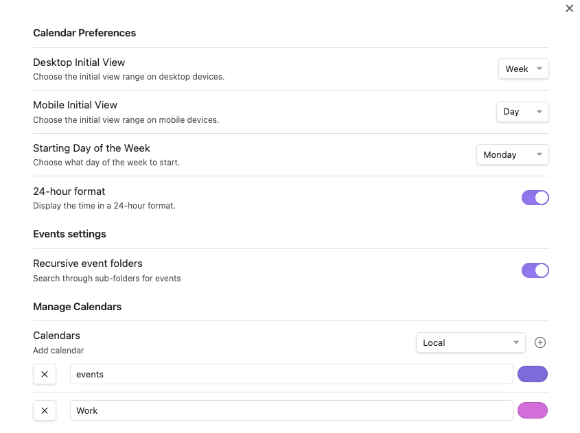
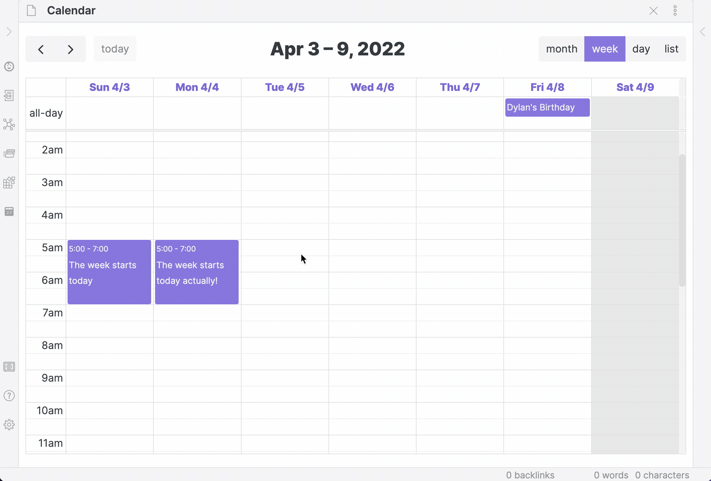

# Display & Behavior Settings

Configure the appearance and behavior of the FullCalendar view to match your workflow.

## First Day of Week
The first day of the week defaults to Sunday, but you can change it to Monday or any other day.

## Default Calendar Views
Choose the initial view that Full Calendar will open to on desktop and mobile devices.

## 24-Hour Time
Display all times in a 24-hour format instead of AM/PM.

## Week/Day All-Day Row
You can show or hide the all-day row at the top of Week and Day views.

- Setting path: Appearance -> View Time Range -> Show all-day row (week/day views)
- When off: the all-day row is hidden, giving more vertical space to timed events.

## Week/Day Header Date Format
You can choose how dates are shown at the top of Week and Day views.

- Setting path: Appearance -> View Time Range -> Week/day header date format
- Available formats include:
	- 9/4 Wed (DD/MM day)
	- 4/9 Wed (MM/DD day)
	- Wed 9/4 (day DD/MM)
	- Wed 4/9 (day MM/DD)
	- 09/04/2026 Wed (DD/MM/YYYY day)
	- 04/09/2026 Wed (MM/DD/YYYY day)

## Timezone Settings
Manage how event times are displayed. See the dedicated [Timezone Support](../events/timezones.md) page for a full explanation.

## Category Coloring
Enable and manage colors for event categories. See the dedicated [Category Coloring](../events/categories.md) page for details.