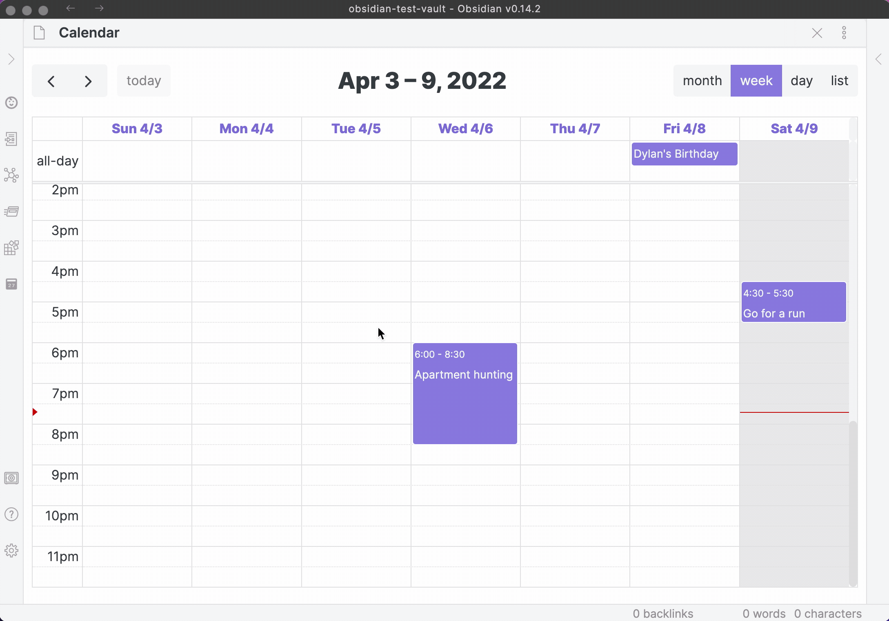

# Manage sources

From Full Calendar settings, you can change your calendar to any directory in your vault, and add a new source and change colors by going to settings. You can also link an **Obsidian Bases** calendar—just make sure the Bases plugin is enabled before adding it.

